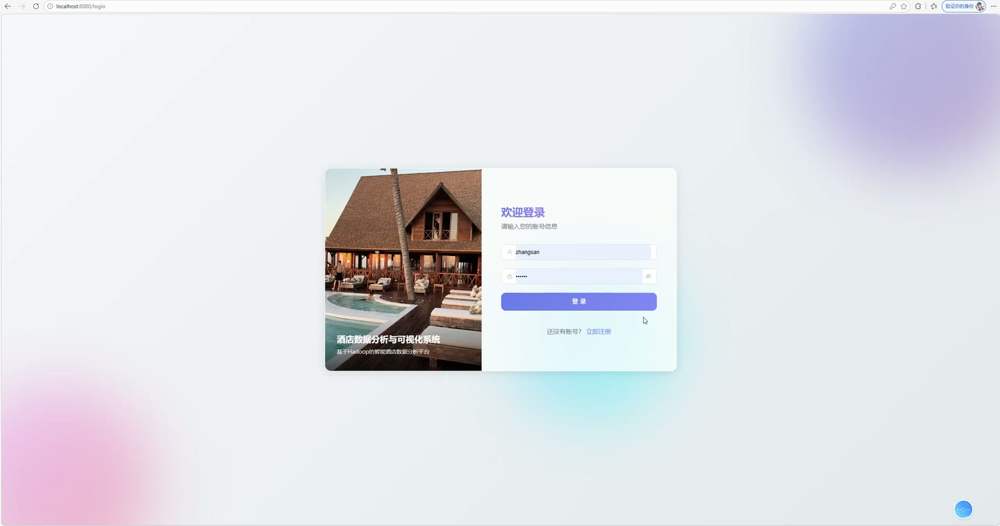
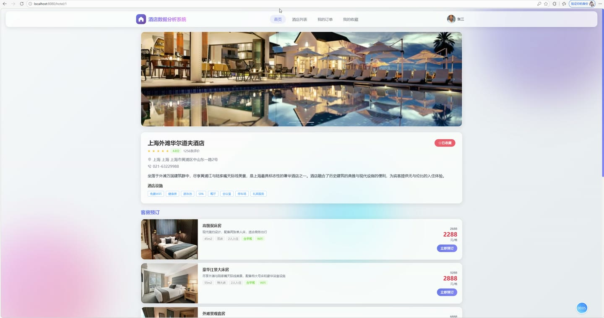
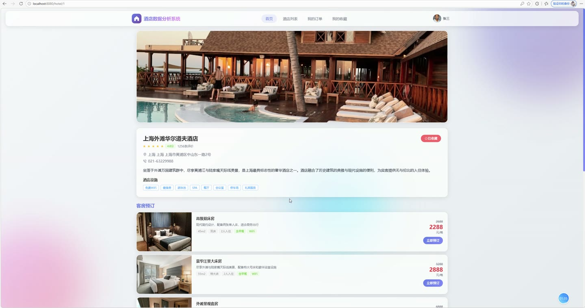
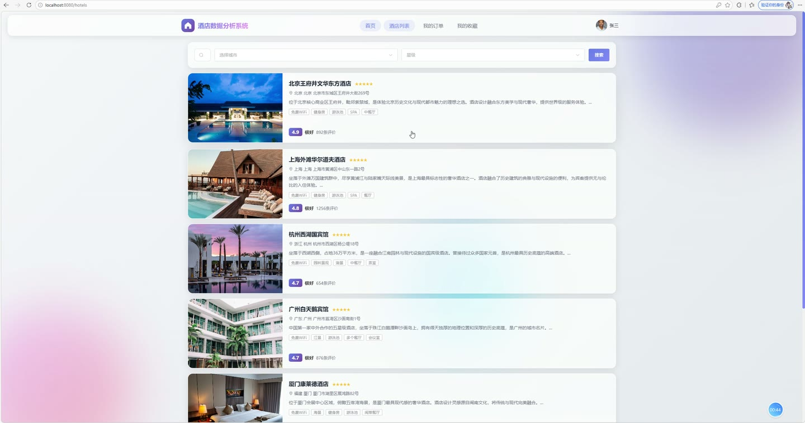
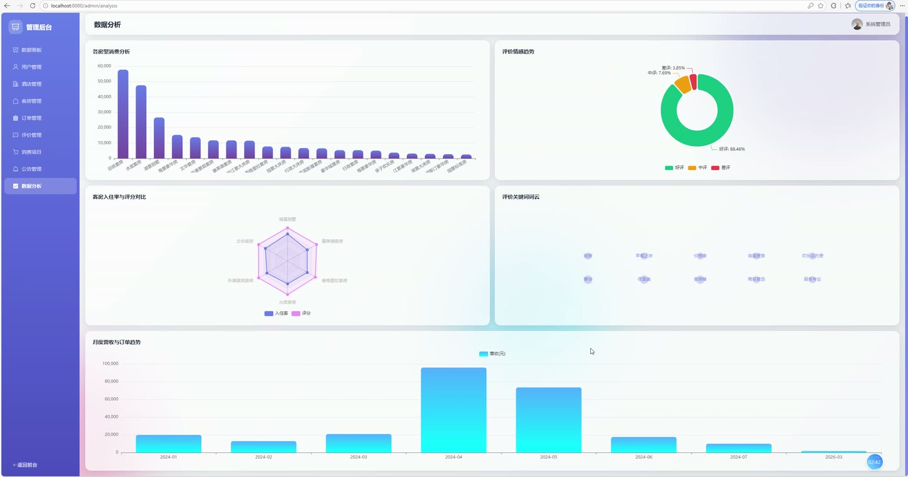
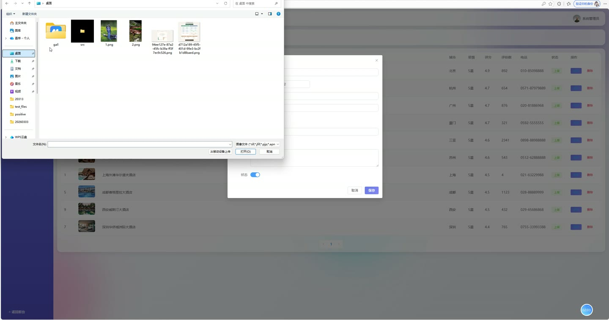

# (附文档)Springboot3+Vue3+MySQL 酒店数据分析与可视化系统

**技术栈**：Springboot3、Vue3、MySQL

### 系统简介

本系统是一套基于 SpringBoot3 + Vue3 + MySQL 的酒店数据分析与可视化平台，采用前后端分离架构，包含普通用户端与管理员端两大角色。系统围绕酒店预订、评价管理、数据分析三大核心业务展开，内置用户行为采集与混合推荐算法，支持多维度经营数据可视化展示，帮助酒店运营方全面掌握用户消费偏好、客房入住率、月度营收趋势及用户情感反馈。
 
### 核心功能
 
### 普通用户端

 
- 用户注册与登录：支持用户名密码注册，密码使用 BCrypt 加密存储，登录后签发 JWT Token 用于后续接口鉴权 
- 酒店浏览与检索：支持按关键词（酒店名称/地址）、城市、星级筛选酒店列表，按评分倒序排列，可查看酒店详情（含地址、电话、星级、设施、经纬度、封面图与相册） 
- 热门酒店推荐：首页展示评分最高的 Top 6 酒店列表，按平均评分降序排列 
- 房型查看与筛选：查看某酒店下的所有在售房型（按价格升序），支持按房型名称模糊搜索，房型详情包含价格、原价、面积、床型、最大入住人数、早餐、窗户、WiFi、设施、总房间数与可订房间数 
- 在线下单预订：选择酒店、房型、入住/离店日期、房间数量，填写入住人姓名与手机号，系统自动计算入住晚数与总价（单价×晚数×房间数），生成唯一订单号（ORD+日期+序号） 
- 订单支付：对状态为待支付的订单进行支付操作，支持选择支付方式（如支付宝、微信等），支付成功后自动扣减对应房型的可订房间数并记录支付时间 
- 我的订单管理：查看个人订单列表，支持按订单状态筛选，订单信息自动关联显示酒店名称、房型名称与用户昵称 
- 酒店收藏/取消收藏：对感兴趣的酒店可一键收藏或取消收藏，收藏列表分页展示并显示酒店完整信息 
- 发表评价：对入住过的酒店进行评分（1-5星）与文字评价，可上传评价图片，系统自动进行情感分析（积极/中性/消极）、情感评分（0-1）与关键词提取（服务、环境、位置、设施、早餐、景色、干净、舒适、价格、交通） 
- 我的评价管理：查看个人历史评价记录，包含评价内容、评分、情感标签、酒店名称与房型名称 
- 智能酒店推荐：基于用户行为（浏览/预订/评价）与订单记录，采用混合协同过滤算法（用户相似度+物品相似度+热门兜底）生成个性化酒店推荐列表，展示推荐评分与推荐理由 
- 公告查看：查看系统最新公告列表，支持按公告类型筛选，公告按置顶状态与发布时间倒序排列 
- 个人资料管理：查看与编辑个人基本信息（昵称、头像、手机号、邮箱、性别），支持修改登录密码（需验证原密码） 
- 消费项目浏览：查看某酒店下的在售消费项目（如餐饮、SPA、洗衣等），按类别分组展示，包含项目名称、类别、价格与描述
 
### 管理员端

 
- 仪表盘数据总览：展示核心经营指标——总用户数（角色为USER）、总酒店数（状态启用）、总订单数、总收入（已支付订单金额合计）、总评价数、平均评分（所有评价评分的均值，保留一位小数） 
- 房型消费分析：按房型维度统计消费总额与订单数量，按消费金额降序排列，用于识别高贡献房型 
- 用户情感分析：统计评价的情感分布（积极/中性/消极数量与总数），同时提取出现频次最高的前10个评价关键词及其出现次数 
- 用户来源分析：按用户注册来源（source字段）分组统计用户数量，了解不同渠道的拉新效果 
- 月度营收趋势：按月统计已支付订单的营收总额（基于支付时间），按月份升序输出，用于观察营收变化趋势 
- 酒店排行榜：展示评分最高的前10家酒店，包含酒店名称、评分、评价总数与所在城市 
- 房型入住率分析：按入住率降序展示前10个房型，包含房型名称、入住率、平均评分与价格 
- 酒店管理：支持新增、编辑、删除酒店信息，可按关键词/城市/星级/状态筛选酒店列表，查看酒店详情（含描述、地址、设施、图片、经纬度、评分与评价数） 
- 房型管理：支持新增、编辑、删除房型，可按酒店与关键词筛选房型列表，管理房价、可订房间数、入住率、评分、设施等字段 
- 订单管理：分页查看全部订单，支持按用户ID、酒店ID、订单状态筛选，查看订单详情（含订单号、入住人信息、金额、支付方式与时间），可修改订单状态、删除异常订单 
- 用户管理：分页查看用户列表，支持按关键词（用户名/昵称/手机号）与角色筛选，可启用/禁用用户账号、删除用户、编辑用户基本信息（密码字段不更新） 
- 评价管理：查看全部评价列表，支持按酒店与情感类型筛选，可回复用户评价（填写回复内容并记录回复时间）、修改评价审核状态、删除违规评价 
- 公告管理：发布新公告（标题、内容、类型、封面图、置顶标记、发布状态与时间），支持公告列表分页查询、编辑、删除，前台展示最新公告 
- 消费项目管理：维护酒店消费项目（名称、类别、价格、描述、图片、状态），支持按酒店与类别筛选列表，可新增、编辑、删除项目 
- 文件上传与删除：支持上传图片等文件（生成UUID唯一文件名并保存至服务器），返回可访问的URL路径，同时支持按文件名删除已上传文件
 
### 技术栈

  后端框架 SpringBoot 3.x   ORM框架 MyBatis-Plus（含分页插件、逻辑删除、自动填充）   权限认证 JWT（jjwt） + BCrypt密码加密（Hutool）   前端框架 Vue 3 + Vite + Vue Router + Pinia   UI组件库 Element Plus   HTTP请求 Axios   数据可视化 ECharts   数据库 MySQL 8.x   构建工具 Maven   其他工具 Lombok、Hutool 
 
### 交付内容

 
- 后端完整源码 
- 前端完整源码 
- 数据库初始化脚本 
- 万字文档

## 界面展示

---

## 获取完整源码 + 万字文档

本仓库为项目介绍页。**完整前后端源码、数据库初始化脚本、万字项目文档**，请加微信 `kangkangcode`，或访问 [codekk.top](http://codekk.top) 获取。

可作课程设计 / 毕业设计参考，支持远程部署调试。